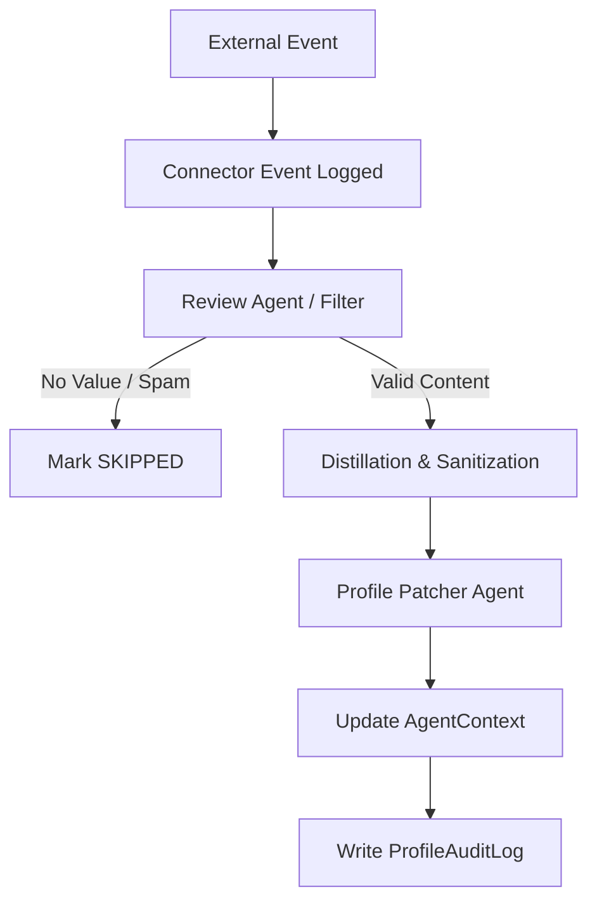

# Personal Context Hub Connectors Specification

Status: authoritative future personal profile connector spec.
Cross-references:
- [MODEL_ROUTING.md](file:///Users/pro/Desktop/Gennety/docs/MODEL_ROUTING.md) (cheap tier models for distillation and vector processing)
- [AGENT_COLLABORATION_PIPELINE.md](file:///Users/pro/Desktop/Gennety/docs/AGENT_COLLABORATION_PIPELINE.md) (collaboration events and logs)
- [ARCHITECTURE.md](file:///Users/pro/Desktop/Gennety/docs/ARCHITECTURE.md) (privacy guidelines and AgentContext models)

---

## 1. Goal and Concepts

While community-scoped connectors ingest data into `CommunityKnowledge*` models for the entire group, **Personal Context Hub Connectors** allow an individual `Owner` to securely link external workspaces (GitHub, Notion, Linear, Obsidian, Calendar) to enrich their own `AgentContext` (e.g., expertise, current projects, looking-for terms).

This system operates under strict user consent, sanitizes all inputs to prevent prompt injection attacks, and cryptographically secures all OAuth and API tokens.

---

## 2. Database Schema

Add the following structures to `prisma/schema.prisma`:

```prisma
model PersonalConnector {
  id             String   @id @default(cuid())
  ownerId        String   @map("owner_id")
  owner          Owner    @relation(fields: [ownerId], references: [id], onDelete: Cascade)
  type           String   // "GITHUB" | "NOTION" | "LINEAR" | "OBSIDIAN" | "CALENDAR"
  enabled        Boolean  @default(true)
  
  // Cryptographically encrypted OAuth tokens/keys
  encryptedToken String?  @map("encrypted_token") @db.Text
  tokenIv        String?  @map("token_iv")
  
  config         Json?    // e.g., {"repos": ["org/repo"], "excludedPages": ["/private"]}
  createdAt      DateTime @default(now()) @map("created_at")
  updatedAt      DateTime @updatedAt @map("updated_at")

  events         PersonalConnectorEvent[]

  @@unique([ownerId, type])
  @@map("personal_connectors")
}

model PersonalConnectorEvent {
  id          String            @id @default(cuid())
  connectorId String            @map("connector_id")
  connector   PersonalConnector @relation(fields: [connectorId], references: [id], onDelete: Cascade)
  
  externalId  String            @map("external_id") // Unique ID from source (e.g. Commit SHA, Issue ID)
  title       String
  rawPayload  Json              @map("raw_payload")
  distilled   String?           @map("distilled") @db.Text
  status      String            @default("PENDING") // "PENDING" | "DISTILLED" | "SKIPPED" | "PROCESSED"
  createdAt   DateTime          @default(now()) @map("created_at")

  @@unique([connectorId, externalId])
  @@map("personal_connector_events")
}

model ProfileAuditLog {
  id        String   @id @default(cuid())
  ownerId   String   @map("owner_id")
  owner     Owner    @relation(fields: [ownerId], references: [id], onDelete: Cascade)
  
  action    String   // "UPDATE_FIELD" | "REMOVE_FIELD"
  fieldPath String   @map("field_path") // e.g., "expertise" | "currentWork"
  oldValue  String?  @map("old_value") @db.Text
  newValue  String?  @map("new_value") @db.Text
  createdAt DateTime @default(now()) @map("created_at")

  @@index([ownerId])
  @@map("profile_audit_logs")
}
```

---

## 3. Cryptographic Security Layer

OAuth tokens, refresh tokens, and webhook secrets are highly sensitive and must never be stored as plain text or logged.
* **Encryption Algorithm**: AES-256-GCM.
* **Key Derivation**: The key must be read from the environment variable `CONNECTOR_SECRET_KEY` (minimum 32-bytes).
* **Implementation Details**:
  * An initialization vector (IV) is generated dynamically for each encryption event and stored in `tokenIv`.
  * The authentication tag must be appended to the encrypted output or stored safely to verify integrity upon decryption.
  * If `CONNECTOR_SECRET_KEY` is missing or weak, connector database writes must fail immediately.

---

## 4. Ingestion Webhooks and Polling

### 4.1 Webhook Endpoints (Event-Driven)
Webhooks ingest real-time events from SaaS platforms:
* `/api/webhooks/personal/github` (validates webhook secret signatures via SHA-256 HMAC).
* `/api/webhooks/personal/notion` (receives page updates).
* `/api/webhooks/personal/linear` (receives issue edits, state transitions).

### 4.2 Polling Adaptors (Cron-Driven)
A cron job `/api/cron/personal-connectors` triggers every 15-30 minutes for poll-based sources:
* **Obsidian**: Reads files from configured synced directories. Files are processed only if they contain a metadata tag `#gennety-sync`.
* **Apple/Google Calendar**: Queries events for the next 7 days, filtering out private blocks (e.g. marked as "Private" or "Busy").
* *Gmail/broad email ingestion is strictly out of scope for v1.*

---

## 5. Processing Pipeline and Profile Patching

All ingested data passes through the following pipeline:



### 5.1 Step 1: Review Agent & Prompt Injection Filter
1. Raw event details are loaded.
2. A Review Agent is invoked using `resolveModel("distillation")`.
3. The raw content is parsed for prompt injections. Any instruction commands (e.g., "Ignore previous rules...") are stripped.
4. The Review Agent checks if the change contains durable value. (Example: "fixed typo" $\rightarrow$ `SKIPPED`; "added implementation of budget guard" $\rightarrow$ `PENDING`).

### 5.2 Step 2: Distillation
The text is distilled into key bullet points:
* Stated technologies used (updates `expertise` array).
* Active projects (updates `currentWork`).
* Dynamic collaboration needs (updates `lookingFor`).

### 5.3 Step 3: Profile Patcher
1. The Profile Patcher reads the current `AgentContext` and the distilled connector text.
2. It generates a diff proposal.
3. Updates to `AgentContext` are strictly **additive** (e.g., appending new skills or updating current work).
4. If a field is to be removed, it requires human validation.
5. All successful updates write to `ProfileAuditLog`.
